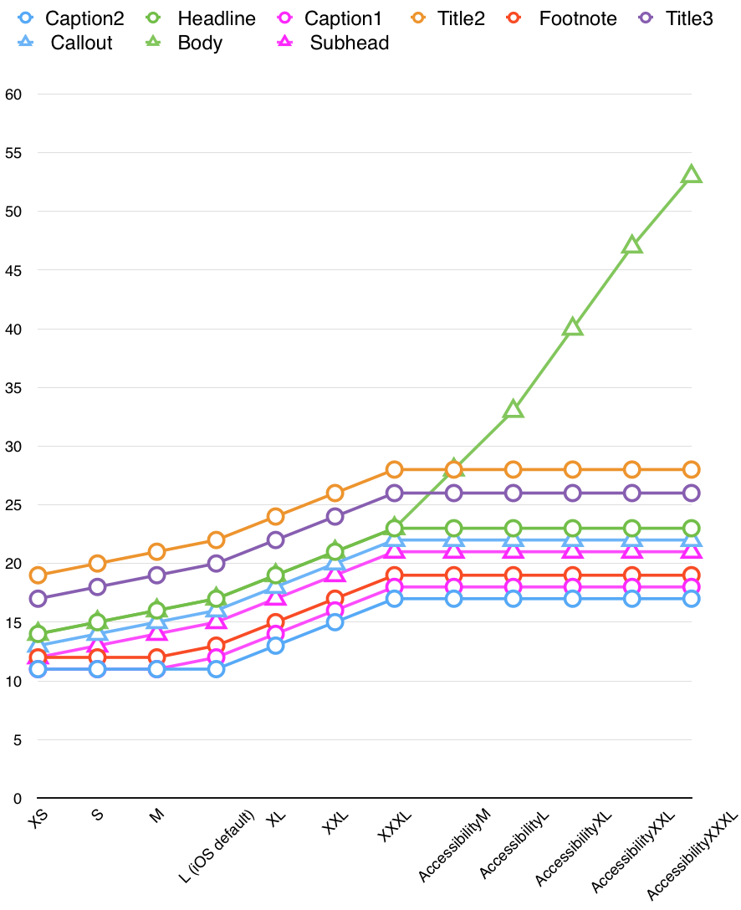
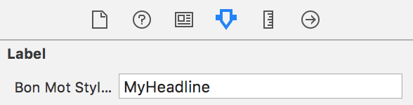
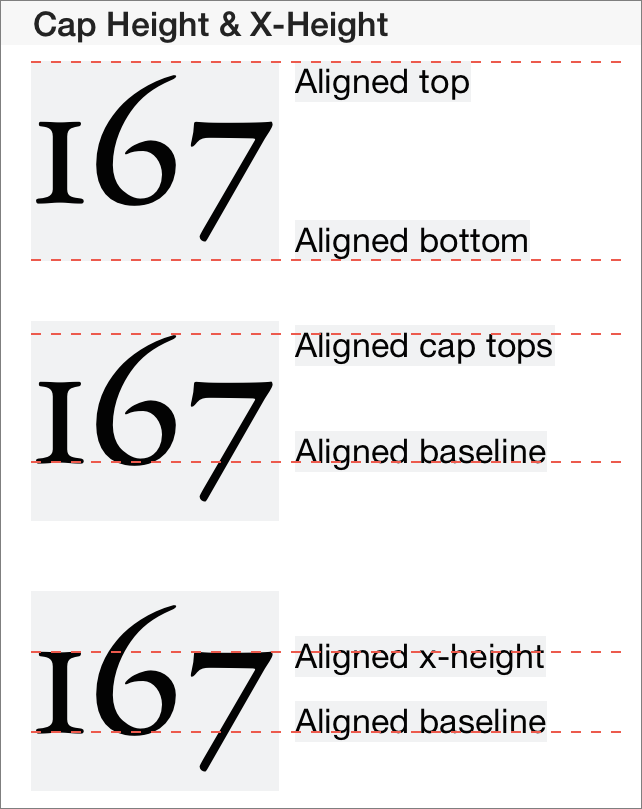
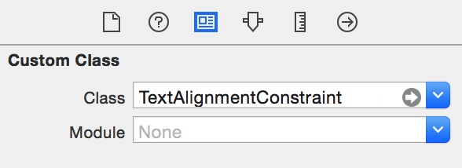
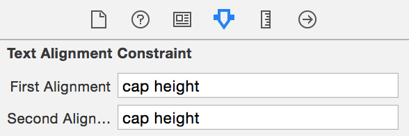

[](https://swift.org)
[](https://circleci.com/gh/Raizlabs/BonMot)
[](http://cocoapods.org/pods/BonMot)
[](http://cocoapods.org/pods/BonMot)
[](http://cocoapods.org/pods/BonMot)
[](https://github.com/Carthage/Carthage)

BonMot (pronounced *Bon Mo*, French for *good word*) is a Swift attributed string library. It abstracts away the complexities of the iOS, macOS, tvOS, and watchOS typography tools, freeing you to focus on making your text beautiful.

To run the example project, run `pod try BonMot`, or clone the repo, open `BonMot.xcodeproj`, and run the **Example-iOS** target.

### Note
If you are migrating a project from BonMot 3 to BonMot 4, please see the [Migration Guide](#bonmot-3--4-migration-guide).

# Usage

In any Swift file where you want to use BonMot, simply `import BonMot`.

## Basics

Use a `StringStyle` to specify the style of your attributed string. Then, use the `styled(with:)` method on `String` to get your attributed string:

```swift
let quote = """
    I used to love correcting people’s grammar until \
    I realized what I loved more was having friends.
    -Mara Wilson
    """

let style = StringStyle(
    .font(UIFont(name: "AmericanTypewriter", size: 17)!),
    .lineHeightMultiple(1.8)
)

let attributedString = quote.styled(with: style)

// You can also get the style’s attributes dictionary
// if you’re using an API that requires it.
let attributes = style.attributes
```

### Glossary

These are the types with which you will most commonly interact when using BonMot to build attributed strings.

- `StringStyle`: a collection of attributes which can be used to style a string. These include basics, like font and color, and more advanced settings like paragraph controls and OpenType features. To get a good idea of the full set of features that BonMot supports, look at the interface for this struct.
- `StringStyle.Part`: an enum which can be used to concisely construct a `StringStyle`. You will typically interact with these, rather than constructing `StringStyle`s attribute by attribute.
- `Composable`: a protocol defining any type that knows how to append itself to an attributed string. BonMot provides functions, such as the one in [this example](#debugging--testing-helpers), to join together multiple `Composable` values.
- `NamedStyles`: use this to register custom, reusable styles in a global namespace.
- `Special`: a utility to include special, ambiguous, and non-printing characters in your strings without making your code unreadable.

### Style Inheritance

Styles can inherit from each other, which lets you create multiple styles that share common attributes:

```swift
let baseStyle = StringStyle(
    .lineHeightMultiple(1.2),
    .font(UIFont.systemFont(ofSize: 17))
)

let redStyle = baseStyle.byAdding(.color(.red))
let blueStyle = baseStyle.byAdding(.color(.blue))

let redBirdString = "bird".styled(with: redStyle)
let blueBirdString = "bird".styled(with: blueStyle)
```

### XML Parsing

Are you trying to style just part of a string, perhaps even a localized string which is different depending on the locale of the app? No problem! BonMot can turn custom XML tags and simple HTML into attributed strings:

```swift
// This would typically be a localized string
let string = "one fish, two fish, <red>red fish</red>,<BON:noBreakSpace/><blue>blue fish</blue>"

let redStyle = StringStyle(.color(.red))
let blueStyle = StringStyle(.color(.blue))

let fishStyle = StringStyle(
    .font(UIFont.systemFont(ofSize: 17)),
    .lineHeightMultiple(1.8),
    .color(.darkGray),
    .xmlRules([
        .style("red", redStyle),
        .style("blue", blueStyle),
        ])
)

let attributedString = string.styled(with: fishStyle)
```

This will produce:


> Note the use of `<BON:noBreakSpace/>` to specify a special character within the string. This is a great way to add special characters to localized strings, since localizers might not know to look for special characters, and many of them are invisible or ambiguous when viewed in a normal text editor. You can use any characters in the `Special` enum, or use `<BON:unicode value='A1338'/>` or `&#a1338;`

#### XML Parsing with Error Handling

If the above method encounters invalid XML, the resulting string will be the entire original string, tags and all. If you are parsing XML that is out of your control, e.g. variable content from a server, you may want to use this alternate parsing mechanism, which allows you to handle errors encountered while parsing:

```swift
let rules: [XMLStyleRule] = [
    .style("strong", strongStyle),
    .style("em", emStyle),
]

let xml = // some XML from a server

do {
    let attrString = try NSAttributedString.composed(ofXML: xml, rules: rules)
}
catch {
    // Handle errors encountered by Foundation's XMLParser,
    // which is used by BonMot to parse XML.
}
```

## Image Attachments

BonMot uses `NSTextAttachment` to embed images in strings. You can use BonMot’s `NSAttributedString.composed(of:)` API to chain images and text together in the same string:

```swift
let someImage = ... // some UIImage or NSImage

let attributedString = NSAttributedString.composed(of: [
    someImage.styled(with: .baselineOffset(-4)), // shift vertically if needed
    Special.noBreakSpace, // a non-breaking space between image and text
    "label with icon", // raw or attributed string
    ])
```

> Note the use of the `Special` type, which gives you easy access to Unicode characters that are commonly used in UIs, such as spaces, dashes, and non-printing characters.

Outputs:


If you need to wrap multiple lines of text after an image, use `Tab.headIndent(...)` to align the whole paragraph after the image:

```swift
let attributedString = NSAttributedString.composed(of: [
    someImage.styled(with: .baselineOffset(-4.0)), // shift vertically if needed
    Tab.headIndent(10), // horizontal space between image and text
    "This is some text that goes on and on and spans multiple lines, and it all ends up left-aligned",
    ])
```

Outputs:


## Dynamic Type

You can easily make any attributed string generated by BonMot respond to the system text size control. Simply add `.adapt` to any style declaration, and specify whether you want the style to scale like a `.control` or like `.body` text.

```swift
let style = StringStyle(
    .adapt(.control)
    // other style parts can go here as needed
)

someLabel.attributedText = "Label".styled(with: style).adapted(to: traitCollection)
```

If you want an attributed string to adapt to the current content size category, when setting it on a UI element, use `.adapted(to: traitCollection)` as in the above example.

### Responding to Content Size Category Changes

If you call `UIApplication.shared.enableAdaptiveContentSizeMonitor()` at some point in your app setup code, BonMot will update common UI elements as the preferred content size category changes. You can opt your custom controls into automatic updating by conforming them to the `AdaptableTextContainer` protocol.

If you want more manual control over the adaptation process and are targeting iOS 10+, skip enabling the adaptive content size monitor, and call `.adapted(to: traitCollection)` inside `traitCollectionDidChange(_:)`. iOS 10 introduced a `preferredContentSizeCategory` property on `UITraitCollection`.

### Scaling Behaviors

The `.control` and `.body` behaviors both scale the same, except that when enabling the "Larger Dynamic Type" accessibility setting, `.body` grows unbounded. Here is a graph of the default behaviors of the [system Dynamic Type styles](https://developer.apple.com/ios/human-interface-guidelines/visual-design/typography#dynamic-type-sizes):



## Storyboard and XIB Integration

You can register global named styles, and use them in Storyboards and XIBs via `IBInspectable`:

```swift
let style = StringStyle(
    .font(UIFont(name: "Avenir-Roman", size: 24)!),
    .color(.red),
    .underline(.styleSingle, .red)
)
NamedStyles.shared.registerStyle(forName: "MyHeadline", style: style)
```

You can then use `MyHeadline` in Interface Builder’s Attributes Inspector on common UIKit controls such as buttons and labels:



These same named styles will also be picked up if they are used as tag names in [parsed XML](s#xml-parsing).

## Debugging & Testing Helpers

Use `bonMotDebugString` and `bonMotDebugAttributedString` to print out a version of any attributed string with all of the special characters and image attachments expanded into human-readable XML:

```swift
NSAttributedString.composed(of: [
	image,
	Special.noBreakSpace,
	"Monday",
	Special.enDash,
	"Friday"
	]).bonMotDebugString

// Result:
// <BON:image size='36x36'/><BON:noBreakSpace/>Monday<BON:enDash/>Friday
```

You can use [XML Rules](#xml-parsing) to re-parse the resulting string (except for images) back into an attributed string. You can also save the output of `bonMotDebugString` and use it to validate attributed strings in unit tests.

## Vertical Text Alignment

UIKit lets you align labels by top, bottom, or baseline. BonMot includes `TextAlignmentConstraint`, a layout constraint subclass that lets you align labels by cap height and x-height. For some fonts, this is essential to convey the designer’s intention:



`TextAlignmentConstraint` works with any views that expose a `font` property. It uses Key-Value Observing to watch for changes to the `font` property, and adjust its internal measurements accordingly. This is ideal for use with Dynamic Type: if the user changes the font size of the app, `TextAlignmentConstraint` will update. You can also use it to align a label with a plain view, as illustrated by the red dotted line views in the example above.

**Warning:** `TextAlignmentConstraint` holds strong references to its `firstItem` and `secondItem` properties. Make sure that a view that is constrained by this constraint does not also hold a strong reference to said constraint, because it will cause a retain cycle.

You can use `TextAlignmentConstraint` programmatically or in Interface Builder. In code, use it like this:

```swift
TextAlignmentConstraint.with(
    item: someLabel,
    attribute: .capHeight,
    relatedBy: .equal,
    toItem: someOtherLabel,
    attribute: .capHeight).isActive = true
```

In Interface Builder, start by constraining two views to each other with a `top` constraint. Select the constraint, and in the Identity Inspector, change the class to `TextAlignmentConstraint`:



Next, switch to the Attributes Inspector. `TextAlignmentConstraint` exposes two text fields through [IBInspectables](https://developer.apple.com/library/ios/recipes/xcode_help-IB_objects_media/Chapters/CreatingaLiveViewofaCustomObject.html). Type in the attributes you want to align. You will get a run-time error if you enter an invalid value.



The layout won’t change in Interface Builder (IBDesignable is not supported for constraint subclasses), but it will work when you run your code.

**Note:** some of the possible alignment values are not supported in all configurations. Check out [Issue #37](https://github.com/Raizlabs/BonMot/issues/37) for updates.

# Objective-C Compatibility

BonMot is written in Swift, but you have a few options if you must use it in an Objective-C code base:

- For legacy Objective-C code bases, consider using [BonMot 3.2](https://github.com/Raizlabs/BonMot/releases/tag/3.2), the last major release to be written in Objective-C. Make sure you reference the ReadMe from that tagged release, since the syntax is different than BonMot 4.0 and later.
- If you are mixing Objective-C and Swift, you can create named styles as in the [Interface Builder section](#storyboard-and-xib-integration), and then access those styles in Objective-C:

 ```objc
UILabel *label = [[UILabel alloc] init];
label.bonMotStyleName = @"MyHeadline";
 ```

- Use the inspectable properties of common UIKit elements as in the [Interface Builder section](#storyboard-and-xib-integration).

# BonMot 3 → 4 Migration Guide

BonMot 4 is a major update, but there are some common patterns that you can use to ease the transition. Note that this is mostly for Swift projects that were using BonMot 3. BonMot 4 has only limited [support for Objective-C](#objective-c-compatibility), so please check that section before attempting to upgrade if you need to maintain Objective-C compatibility.

### Separating Style from Content

BonMot 4 introduces the `StringStyle` struct, which encapsulates style information. When you apply a `StringStyle` to a plain `String`, the result is an `NSAttributedString`. This differs from BonMot 3, where a `BONChain` or `BONText` contained both style and string information. The decoupling of content from style follows in the footsteps of HTML/CSS, and makes it easier to test and reason about each component separately from the other.

### Inline Styling

The changes required to support inline styling are minimal. It won’t be a completely mechanical process due to some renaming that took place in 4.0, but it should be fairly straightforward:

##### BonMot 3

```swift
let chain = BONChain()
   .color(myColor)
   .font(myFont)
   .figureSpacing(.Tabular)
   .alignment(.Center)
   .string(text)
label.attributedText = chain.attributedString
```

##### BonMot 4

```swift
label.attributedText = text.styled(
    with:
    .color(myColor),
    .font(myFont),
    .numberSpacing(.monospaced), // renamed in 4.0
    .alignment(.center)
)
```

### Saved Styles

In BonMot 3, you may have stored `BONChain`s for later use. You can accomplish the same thing with BonMot 4’s `StringStyle`, with one main difference: while a `BONChain` can contain a string, a `StringStyle` never does. It is applied to a string, producing an `NSAttributedString`:

##### BonMot 3

```swift
struct Constants {

    static let myChain = BONChain()
        .color(myColor)
        .font(myFont)
        .tagStyles([
            "bold": myBoldChain,
            ])

}

// and then, later:

let attrString = myChain.string("some string").attributedString
```

##### BonMot 4

```swift
struct Constants {

    static let myStyle = StringStyle(
        .color(myColor),
        .font(myFont),
        .xmlRules([
            .style("bold", myBoldStyle),
            ]))

}

// and then, later:

let attrString = "some string".styled(with: Constants.myStyle)
```

# Installation

## CocoaPods

BonMot is available through [CocoaPods](http://cocoapods.org). To install
it, simply add the following line to your Podfile:

```ruby
pod 'BonMot'
```

## Carthage

BonMot is also compatible with [Carthage](https://github.com/Carthage/Carthage). To install it, simply add the following line to your Cartfile:

```ogdl
github "Raizlabs/BonMot"
```

# Contributing

Issues and pull requests are welcome! Please ensure that you have the latest [SwiftLint](https://github.com/realm/SwiftLint) installed before committing and that there are no style warnings generated when building.

Contributors are expected to abide by the [Contributor Covenant Code of Conduct](https://github.com/Raizlabs/BonMot/blob/master/CONTRIBUTING.md).

# Author

Zev Eisenberg: [zev.eisenberg@raizlabs.com](mailto:zev.eisenberg@raizlabs.com), [@ZevEisenberg](https://twitter.com/zeveisenberg)

Logo by Jon Lopkin: [@jonlopkin](https://twitter.com/jonlopkin)

# License

BonMot is available under the MIT license. See the LICENSE file for more info.
