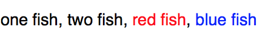
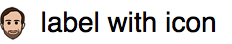
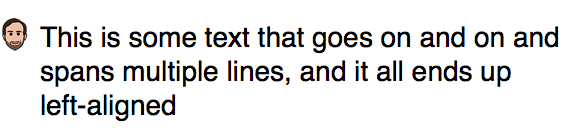
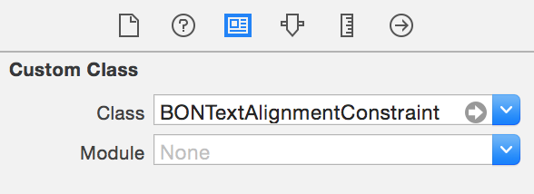
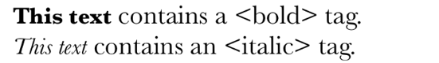
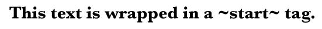

[](https://travis-ci.org/Raizlabs/BonMot)
[](http://cocoapods.org/pods/BonMot)
[](http://cocoapods.org/pods/BonMot)
[](http://cocoapods.org/pods/BonMot)
[](https://github.com/Carthage/Carthage)

BonMot (pronounced *Bon Mo*, French for *good word*) is an iOS attributed string generation library. It abstracts away the advanced iOS typography tools, freeing you to focus on making your text beautiful.

To run the example project, run `pod try BonMot`, or clone the repo and open `Example/BonMot.xcworkspace`.

## Installation with CocoaPods

BonMot is available through [CocoaPods](http://cocoapods.org). To install
it, simply add the following line to your Podfile:

```ruby
pod 'BonMot'
```

If you want to use the [UIKit Utilities](#uikit-utilities), add:

```ruby
pod 'BonMot/UIKit'
```

## Installation with Carthage

BonMot is also compatible with [Carthage](https://github.com/Carthage/Carthage). To install it, simply add the following line to your Cartfile:

```ogdl
github "Raizlabs/BonMot"
```

## Supported Text Features

BonMot uses attributed strings to give you control over the following typographical features:

- Font
- Text color
- Tracking (in either UIKit Points or Adobe-friendly thousandths of an *em*)
- First line head indent
- Head indent
- Tail indent
- Line height multiple
- Maximum line height
- Minimum line height
- Line spacing
- Line break mode
- Paragraph spacing before
- Paragraph spacing after
- Baseline offset
- Hyphenation factor (the threshold for hyphenating across line breaks)
- Text alignment
- Underlining and strikethrough
- Figure case (uppercase vs. lowercase numbers)
- Figure spacing (monospace vs. proportional numbers)
- URLs
- Inline Images with optional multi-line paragraph alignment
- Tag parsing (excluding nested tags)

Think something is missing? Please [file an issue](https://github.com/Raizlabs/BonMot/issues) (or add a +1 if one already exists).

## Usage

In any Swift file where you want to use BonMot, simply `import BonMot`. In Objective-C, that’s `#import <BonMot/BonMot.h>` or `@import BonMot`.

The basic object in BonMot is `BONChain`, which allows you quickly construct attributed strings. You can create a chain with a normal `BonChain()` in Swift or either `[[BONChain alloc] init]`, `[BONChain new]`, or `BONChain.new` in Objective-C:

```swift
let quote = "I used to love correcting people's grammar until" +
            "I realized what I loved more was having friends.\n" +
            "-Mara Wilson"

// line-wrapped for readability
let attributedString = BONChain()
    .lineHeightMultiple(1.2)
    .fontNameAndSize("AmericanTypewriter", 17.0)
    .string(quote)
    .attributedString   // You can also query .attributes
                        // and get back a dictionary of attributes
```
<details>
<summary>Objective-C</summary>
```objc
NSString *quote = @"I used to love correcting people’s grammar until\
 I realized what I loved more was having friends.\n\
—Mara Wilson";

// line-wrapped for readability
NSAttributedString *attributedString =
BONChain.new // [BONChain new] and [[BONChain alloc] init] also work
    .fontNameAndSize(@"AmericanTypewriter", 17.0)
    .lineHeightMultiple(1.8)
    .string(quote)
    .attributedString; // You can also query .attributes
                       // and get back a dictionary of attributes

```
</details>

You can also create a local variable or property to save a partially-configured chain. All the chaining methods pass copies of the chain, so you don't have to worry about later changes clobbering earlier properties:

```swift
// Base Chain
let birdChain = BONChain()
    .lineHeightMultiple(1.2)
    .font(UIFont.systemFontOfSize(17.0))
    .string("bird")

// Two chains with different colors
// that inherit their parents’ properties
let redBirds = birdChain.color(.redColor())
let blueBirds = birdChain.color(.blueColor())

// Two different attributed strings with all attributes shared
// except for text color
let redBirdString = redBirds.attributedString
let blueBirdString = blueBirds.attributedString
```
<details>
<summary>Objective-C</summary>
```objc
// Base Chain
BONChain *birdChain =
BONChain.new
    .lineHeightMultiple(1.2)
    .font([UIFont systemFontOfSize:17.0])
    .string(@"bird");

// Two chains with different colors
// that inherit their parents’ properties
BONChain *redBirds = birdChain.color([UIColor redColor]);
BONChain *blueBirds = birdChain.color([UIColor blueColor]);
</details>

// two different attributed strings with all attributes shared
// except for text color
NSAttributedString *redBirdString = redBirds.attributedString;
NSAttributedString *blueBirdString = blueBirds.attributedString;
```
</details>

## Concatenation

You can concatenate an array of `BONChain`s or `BONText`s:
```swift
let oneFish = BONChain().string("one fish")
let twoFish = BONChain().string("two fish")
let redFish = BONChain().string("red fish").color(.redColor())
let blueFish = BONChain().string("blue fish").color(.blueColor())
let separator = BONChain().string(", ")

let string = BONText.joinTextables([oneFish, twoFish, redFish, blueFish], withSeparator: separator)
```
<details>
<summary>Objective-C</summary>
```objc
BONChain *oneFish = BONChain.new.string(@"one fish");
BONChain *twoFish = BONChain.new.string(@"two fish");
BONChain *redFish = BONChain.new.string(@"red fish").color([UIColor redColor]);
BONChain *blueFish = BONChain.new.string(@"blue fish").color([UIColor blueColor]);
BONChain *separator = BONChain.new.string(@", ");

NSAttributedString *string = [BONText joinTextables:@[ oneFish, twoFish, redFish, blueFish ] withSeparator:separator];
```
</details>

You can also append chains directly to each other:
```swift
let commaSpace = BONChain().string(", ")
let chain = BONChain()
chain.appendLink(BONChain().string("one fish"))
chain.appendLink(BONChain().string("two fish"), separatorTextable: commaSpace)
chain.appendLink(BONChain().string("red fish").color(.redColor()), separatorTextable: commaSpace)
chain.appendLink(BONChain().string("blue fish").color(.blueColor()), separatorTextable: commaSpace)

let string = chain.attributedString
```
<details>
<summary>Objective-C</summary>
```objc
NSString *commaSpace = BONChain.new.string(@", ");
BONChain *chain = BONChain.new;
[chain appendLink:BONChain.new.string(@"one fish")];
[chain appendLink:BONChain.new.string(@"two fish") separator:commaSpace];
[chain appendLink:BONChain.new.string(@"red fish").color([UIColor redColor]) separator:commaSpace];
[chain appendLink:BONChain.new.string(@"blue fish").color([UIColor blueColor]) separator:commaSpace];

NSAttributedString *string = chain.attributedString;
```
</details>

Both examples output:



## Image Attachments

BonMot uses `NSTextAttachment` to embed images in strings. Simply use the `.image` property of a chain:
```swift
let space = BONChain().string(" ")
let chain = BONChain()
chain.appendLink(BONChain().image(someUIImage).baselineOffset(-4.0))
chain.appendLink(BONChain().string("label with icon"), separatorTextable: space)
let string = chain.attributedString
```
<details>
<summary>Objective-C</summary>
```objc
BONChain *space = BONChain.new.string(@" ")
BONChain *chain = BONChain.new;
[chain appendLink:BONChain.new.image(someUIImage).baselineOffset(-4.0)];
[chain appendLink:BONChain.new.string(@"label with icon") separatorTextable: space];
NSAttributedString *string = chain.attributedString;
```
</details>

Outputs:



If you need to wrap multiple lines of text after an image, use the `indentSpacer` property to align the whole paragraph after the image:
```swift
let quote = "This is some text that goes on and on and spans multiple lines, and it all ends up left-aligned"
let space = BONChain().string(" ")
let chain = BONChain()
chain.appendLink(BONChain().image(someUIImage).indentSpacer(10.0))
chain.appendLink(BONChain().string(quote), separatorTextable: space)
let string = chain.attributedString
```
<details>
<summary>Objective-C</summary>
```objc
NSString *quote = @"This is some text that goes on and on and spans multiple lines, and it all ends up left-aligned";
BONChain *chain = BONChain.new;
[chain appendLink:BONChain.new.image(someUIImage).indentSpacer(10.0)];
[chain appendLink:BONChain.new.string(quote)];
NSAttributedString *attributedString = chain.attributedString;
```
</details>

Outputs:



## Special Characters

You can easily access those hard-to-find special characters using the `BONSpecial` class. These include the No-Break Space, En and Em Spaces, various kinds of dashes, and more. If it’s hard to see in your source code or debug logs, it belongs in `BONSpecial`. If you want to add special characters to BonMot, add them to `BONSpecialGenerator.swift` (requires Xcode 7), run `swift BONSpecialGenerator.swift`, and submit a pull request! See `SpecialCharactersCell.m` in the sample project for some examples of how to use `BONSpecial`.

## Querying Properties

Every `BONChain` is backed by a `BONText` object, which you can access through `BONChain`’s `.text` property. Use a chain’s `BONText` if you need to extract properties. This can be useful, for example, when vending a `BONChain` from a view model.

## UIKit Utilities

BonMot provides several utilities that enhance its interoperability with UIKit.

**Note:** to use these utilities, add `pod 'BonMot/UIKit'` to your Podfile.

### Text UI Elements

BonMot provides a `bonTextable` property on `UILabel`, `UITextView`, and `UITextField` that allows assigning a `BONTextable` object to apply styling to any strings assigned via the `-setBonString:` method (or `.bonString = ...` in Objective-C).

**Note:** to use these utilities, add `pod 'BonMot/UIKit'` to your Podfile.
```swift
let label = UILabel()

let chain = BONChain().adobeTracking(300).fontNameAndSize("Avenir-Book", 18.0)

label.bonTextable = chain
label.setBonString("Some initial text.")
```
<details>
<summary>Objective-C</summary>
```objc
UILabel *label = [[UILabel alloc] init];

BONChain *chain = BONChain.new.adobeTracking(300).fontNameAndSize(@"Avenir-Book", 18.0f);

label.bonTextable = chain;
[label setBonString:@"Some initial text."];
```
</details>

Outputs:


Some time later, you can update the text of the label with a plain string, without losing the original styling from the `BONTextable`.

```swift
label.setBonString("Some updated text.")
```
<details>
<summary>Objective-C</summary>
```objc
label.bonString = @"Some updated text."; // this shorthand is valid in Obj-C
```
</details>


Outputs:


### Vertical Text Alignment

UIKit lets you align labels by top, bottom, or baseline. BonMot includes `BONTextAlignmentConstraint`, a layout constraint subclass that lets you align labels by cap height and x-height. For some fonts, this is essential to convey the designer’s intention:


`BONTextAlignmentConstraint` works with any views that expose a `font` property. It uses Key-Value Observing to watch for changes to the `font` property, and adjust its internal measurements accordingly. This is ideal for use with Dynamic Type: if the user changes the font size of the app, `BONTextAlignmentConstraint` will update. You can also use it to align a label with a plain view, as illustrated by the red dotted line views in the example above.

**Warning:** `BONTextAlignmentConstraint` holds strong references to its `firstItem` and `secondItem` properties. Make sure that a view that is constrained by this constraint does not also hold a strong reference to said constraint, because it will cause a retain cycle.

You can use `BONTextAlignmentConstraint` programmatically or in Interface Builder. In code, use the convenience initializer:

```swift
BONTextAlignmentConstraint(item: someLabel,
                      attribute: BONConstraintAttribute.CapHeight,
                      relatedBy: .Equal,
                         toItem: someOtherLabel,
                      attribute: BONConstraintAttribute.CapHeight).active = true
```
<details>
<summary>Objective-C</summary>
```objc
[BONTextAlignmentConstraint constraintWithItem:someLabel
                                     attribute:BONConstraintAttributeCapHeight
                                     relatedBy:NSLayoutRelationEqual
                                        toItem:someOtherLabel
                                     attribute:BONConstraintAttributeCapHeight].active = YES;
```
</details>

In Interface Builder, start by constraining two views to each other with a `top` constraint. Select the constraint, and in the Identity Inspector, change the class to `BONTextAlignmentConstraint`:



Next, switch to the Attributes Inspector. `BONTextAlignmentConstraint` exposes two text fields through [IBInspectables](https://developer.apple.com/library/ios/recipes/xcode_help-IB_objects_media/Chapters/CreatingaLiveViewofaCustomObject.html). Type in the attributes you want to align. You will get a run-time error if you enter an invalid value.


The layout won’t change in Interface Builder (IBDesignable is not supported for constraint subclasses), but it will work when you run your code.

**Note:** some of the possible alignment values are not supported in all configurations. Check out [Issue #37](https://github.com/Raizlabs/BonMot/issues/37) for updates.

## Unit Testing helpers

The `bon_humanReadableString` category method on `NSAttributedString` expands special characters out into human-readable strings. This is useful for writing unit tests where you need to compare a BonMot-generated string with an example string which may contain invisible or hard-to-read characters. For example, here’s a string with an embedded image, a non-breaking space, and some text that contains an en dash:
```swift
let chain = BONChain().image(someImage)
chain.appendLink(BONChain().string(BONSpecial.noBreakSpace()))
chain.appendLink(BONChain().string("Monday"))
chain.appendLink(BONChain().string(BONSpecial.enDash()))
chain.appendLink(BONChain().string("Friday"))
print(chain.attributedString.bon_humanReadableString)
```
<details>
<summary>Objective-C</summary>
```objc
BONChain *chain = BONChain.new.image(someImage);
[chain appendLink:BONChain.new.string(BONSpecial.noBreakSpace)];
[chain appendLink:BONChain.new.string(@"Monday")];
[chain appendLink:BONChain.new.string(BONSpecial.enDash)];
[chain appendLink:BONChain.new.string(@"Friday")];

NSLog(@"%@", chain.attributedString.bon_humanReadableString);
```
</details>

Prints this:

```
{image24x36}{noBreakSpace}Monday{enDash}Friday
```

## Tag Styles

BonMot can style text between arbirtrary tags using a `<tag></tag>` format and `\` as an escape character. This allows you to apply styles to substrings of localized strings, whose position, order, and even existence may change from language to language.
```swift
let boldChain = BONChain().fontNameAndSize("Baskerville-Bold", 15.0)
let italicChain = BONChain().fontNameAndSize("Baskerville-Italic", 15.0)

let chain = BONChain().fontNameAndSize("Baskerville", 17.0)
    .tagStyles(["bold": boldChain, "italic": italicChain])
    .string("<bold>This text</bold> contains a \\<bold> tag.\n" +
            "<italic>This text</italic> contains a \\<italic> tag.")
let string = chain.attributedString
```
<details>
<summary>Objective-C</summary>
```objc
BONChain *boldChain = BONChain.new.fontNameAndSize(@"Baskerville-Bold", 15.0f);
BONChain *italicChain = BONChain.new.fontNameAndSize(@"Baskerville-Italic", 15.0f);

BONChain *chain = BONChain.new.fontNameAndSize(@"Baskerville", 17.0f)
    .tagStyles( @{ @"bold": boldChain, @"italic": italicChain } )
    .string(@"<bold>This text</bold> contains a \\<bold> tag.\n<italic>This text</italic> contains an \\<italic> tag.");

NSAttributedString *string = chain.attributedString;
```
</details>

Outputs:



BonMot can also style text between any arbitrary start and end strings using any escape string.
```swift
let boldChain = BONChain().fontNameAndSize("Baskerville-Bold", 15.0)

let chain = BONChain().fontNameAndSize("Baskerville", 17.0)
    .tagComplexStyles([BONTag(startTag: "~start", endTag: "!end", escapeString: "escape", textable: boldChain)])
    .string("~start~This text is wrapped in a escape~start~ tag.!end")
let string = chain.attributedString
```
<details>
<summary>Objective-C</summary>
```objc
BONChain *boldChain = BONChain.new.fontNameAndSize(@"Baskerville-Bold", 15.0f);

BONChain *chain = BONChain.new.fontNameAndSize(@"Baskerville", 17.0f)
.tagComplexStyles(@[BONTagComplexMake(@"~start~", @"!end", @"escape", boldChain)])
.string(@"~start~This text is wrapped in a escape~start~ tag.!end");

NSAttributedString *string = chain.attributedString;
```
</details>

Outputs:



**Note:** Tag styles do not support nested or interleaved tags. The first tag matched will be applied; any additional tags between the start and end will be ignored.


## Contributing

Issues and pull requests are welcome! Please format all code using [`clang-format`](http://clang.llvm.org/docs/ClangFormat.html) and the included `.clang-format` configuration file.


## Author

Zev Eisenberg: <mailto:zev.eisenberg@raizlabs.com>, [@ZevEisenberg](https://twitter.com/zeveisenberg)

Logo by Jon Lopkin: [@jonlopkin](https://twitter.com/jonlopkin)

## License

BonMot is available under the MIT license. See the LICENSE file for more info.
