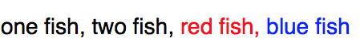

[](https://travis-ci.org/Raizlabs/BonMot)
[](http://cocoapods.org/pods/BonMot)
[](http://cocoapods.org/pods/BonMot)
[](http://cocoapods.org/pods/BonMot)

BonMot (pronounced *Bon Mo*, French for *good word*) is an iOS attributed string generation library. It abstracts away the advanced iOS typography tools, freeing you to focus on making your text beautiful.

To run the example project, run `pod try BonMot`, or clone the repo and open `Example/BonMot.xcworkspace`.

## Installation with CocoaPods

BonMot is available through [CocoaPods](http://cocoapods.org). To install
it, simply add the following line to your Podfile:

```ruby
pod 'BonMot'
```

## Supported Text Features

BonMot uses attributed strings to give you control over the following typographical features:

- Font
- Text Color
- Tracking (in either UIKit Points or Adobe-friendly thousandths of an *em*)
- Line Height Multiple
- Baseline Offset
- Figure Case (uppercase vs. lowercase numbers)
- Figure Spacing (monospace vs. proportional numbers)
- Inline Images with optional multi-line paragraph alignment

Think something is missing? Please [file an issue](https://github.com/Raizlabs/BonMot/issues) (or add a +1 if one already exists).

## Usage

In any file where you want to use BonMot, simply `#import <BonMot/BonMot.h>`.

The basic object in BonMot is `BONText`. You create a text object, set some properties to configure the font, and then ask for its `.attributedString` to get a string formatted according to your specification. Or ask for `.attributes` if you just need the attributes dictionary:

```objc
NSString *quote = @"I used to love correcting people’s grammar until\
 I realized what I loved more was having friends.\n\
—Mara Wilson";

BONText *text = [BONText new];
text.font = [UIFont fontWithName:@"AmericanTypewriter" size:17.0f];
text.lineHeightMultiple = 1.8f;
text.string = quote;

NSAttributedString *string = text.attributedString;
NSDictionary *attributes = text.attributes;
```

## Chaining Syntax

`BONChain` is a wrapper around `BONText` that allows you to chain properties together for a more concise expression of a style. You can create a chain with a normal `[[BONChain alloc] init]`, but it's easier to just use `[BONChain new]` or the even shorter and technically valid `BONChain.new`:

```objc
NSString *quote = @"I used to love correcting people’s grammar until\
 I realized what I loved more was having friends.\n\
—Mara Wilson";

// line-wrapped for readability
NSAttributedString *attributedString =
BONChain.new // [BONChain new] and [[BONChain alloc] init] also work
.fontNameAndSize(@"AmericanTypewriter", 17.0f)
.lineHeightMultiple(1.8f)
.string(quote)
.attributedString;
```

You can also create a local variable or property to save a partially-configured chain. All the chaining methods pass copies of the chain, so you don't have to worry about later changes clobbering earlier properties:

```objc

// Base Chain
BONChain *birdChain =
BONChain.new
.lineHeightMultiple(1.2f)
.font([UIFont systemFontOfSize:17.0f])
.string(@"bird");

// Two chains with different colors
// that inherit their parents’ properties
BONChain *redBirds = birdChain.textColor([UIColor redColor]);
BONChain *blueBirds = birdChain.textColor([UIColor blueColor]);

// two different attributed strings with all attributes shared
// except for text color
NSAttributedString *redBirdString = redBirds.attributedString;
NSAttributedString *blueBirdSring = blueBirds.attributedString;
```

## Concatenation

You can concatenate an array of `BONText`s:

```objc
BONText *oneFish = BONChain.new.string(@"one fish").text;
BONText *twoFish = BONChain.new.string(@"two fish").text;
BONText *redFish = BONChain.new.string(@"red fish").textColor([UIColor redColor]).text;
BONText *blueFish = BONChain.new.string(@"blue fish").textColor([UIColor blueColor]).text;
BONText *separator = BONChain.new.string(@", ").text;

NSAttributedString *string = [BONText joinTexts:@[ oneFish, twoFish, redFish, blueFish ] withSeparator:separator];
```

Outputs:


You can also append texts directly to each other:

```objc
NSString *commaSpace = @", ";
BONChain *chain = BONChain.new;
chain
.append(BONChain.new.string(@"one fish"))
.appendWithSeparator(commaSpace, BONChain.new.string(@"two fish"))
.appendWithSeparator(commaSpace, BONChain.new.string(@"red fish").textColor([UIColor redColor]))
.appendWithSeparator(commaSpace, BONChain.new.string(@"blue fish").textColor([UIColor blueColor]));

NSAttributedString *string = chain.attributedString;
```

Outputs:



(Notice that the comma after `red fish` is red, but in the previous example, it was not colored. This is the behavior that made the most sense to me, but please open an issue or pull request if you think it should be different.)

## Image Attachments

BonMot uses NSTextAttachment to embed images in strings. Simply use the `.image` property of a chain or text:

```objc
BONChain *chain = BONChain.new;
chain
.append(BONChain.new.image(someUIImage).baselineOffset(-4.0f))
.appendWithSeparator(@" ", BONChain.new.text(@"label with icon"));
NSAttributedString *string = chain.attributedString;
```

Outputs:


If you need to wrap multiple lines of text after an image, use the `indentSpacer` property to align the whole paragraph after the image:

```objc
NSString *quote = @"This is some text that goes on and on and spans multiple lines, and it all ends up left-aligned";
BONChain *chain = BONChain.new;
chain
.append(BONChain.new.image(someUIIMage).indentSpacer(10.0f))
.append(BONChain.new.string(quote));
NSAttributedString *attributedString = chain.attributedString;
```

Outputs:


## Special Characters

You can easily access those hard-to-find special characters using the `BONSpecial` class. These include the No-Break Space, En and Em Spaces, various kinds of dashes, and more. If it’s hard to see in your source code or debug logs, it belongs in `BONSpecial`. If you want to add special characters to BonMot, add them to `BONSpecialGenerator.swift` (requires Xcode 7), run `swift BONSpecialGenerator.swift`, and submit a pull request! See `SpecialCharactersCell.m` in the sample project for some examples of how to use `BONSpecial`.

## Vertical Text Alignment

UIKit lets you align labels by top, bottom, or baseline. BonMot includes `BONTextAlignmentConstraint`, a layout constraint subclass that lets you align labels by cap height and x-height. For some fonts, this is essential to convey the designer’s intention:


`BONTextAlignmentConstraint` works with any views that expose a `font` property. It uses Key-Value Observing to watch for changes to the `font` property, and adjust its internal measurements accordingly. This is ideal for use with Dynamic Type: if the user changes the font size of the app, `BONTextAlignmentConstraint` will update. You can also use it to align a label with a plain view, as illustrated by the red dotted lines in the example above.

**Warning:** `BONTextAlignmentConstraint` holds strong references to its `firstItem` and `secondItem` properties. Make sure not to have a view that is constrained by this constraint also hold a strong reference to it, because it will cause a retain cycle.

You can use `BONTextAlignmentConstraint` programmatically or in Interface Builder. In code, use the convenience initializer:

```objc
[BONTextAlignmentConstraint constraintWithItem:someLabel
                                     attribute:BONConstraintAttributeCapHeight
                                     relatedBy:NSLayoutRelationEqual
                                        toItem:someOtherLabel
                                     attribute:BONConstraintAttributeCapHeight].active = YES;
```

In Interface Builder, start by constraining two views to each other with a `top` constraint. Select the constraint, and in the Identity Inspector, change the class to `BONTextAlignmentConstraint`:


Next, switch to the Attributes Inspector. `BONTextAlignmentConstraint` exposes two text fields through [IBInspectables](https://developer.apple.com/library/ios/recipes/xcode_help-IB_objects_media/Chapters/CreatingaLiveViewofaCustomObject.html). Type in the attributes you want to align. You will get a run-time error if you enter an invalid value.


The layout won’t change in Interface Builder (IBDesignable is not supported for constraint subclasses), but it will work when you run your code.

**Note:** some of the possible alignment values are not supported in all configurations. Check out [Issue #37](https://github.com/Raizlabs/BonMot/issues/37) for updates.


## Author

Zev Eisenberg: <mailto:zev.eisenberg@raizlabs.com>, [@ZevEisenberg](https://twitter.com/zeveisenberg)

Logo by Jon Lopkin: [@jonlopkin](https://twitter.com/jonlopkin)

## License

BonMot is available under the MIT license. See the LICENSE file for more info.
